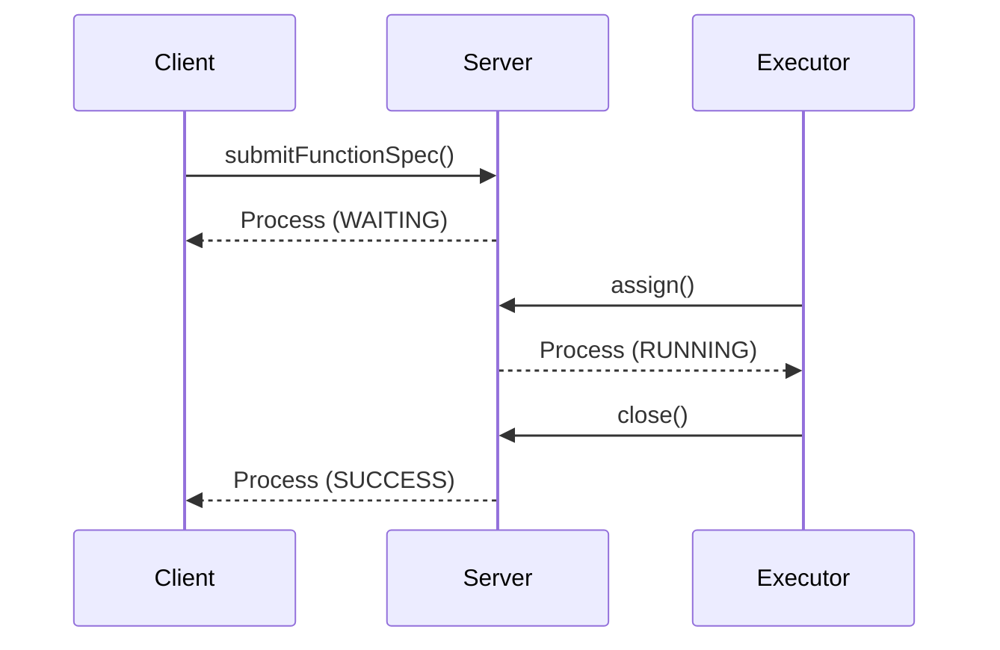
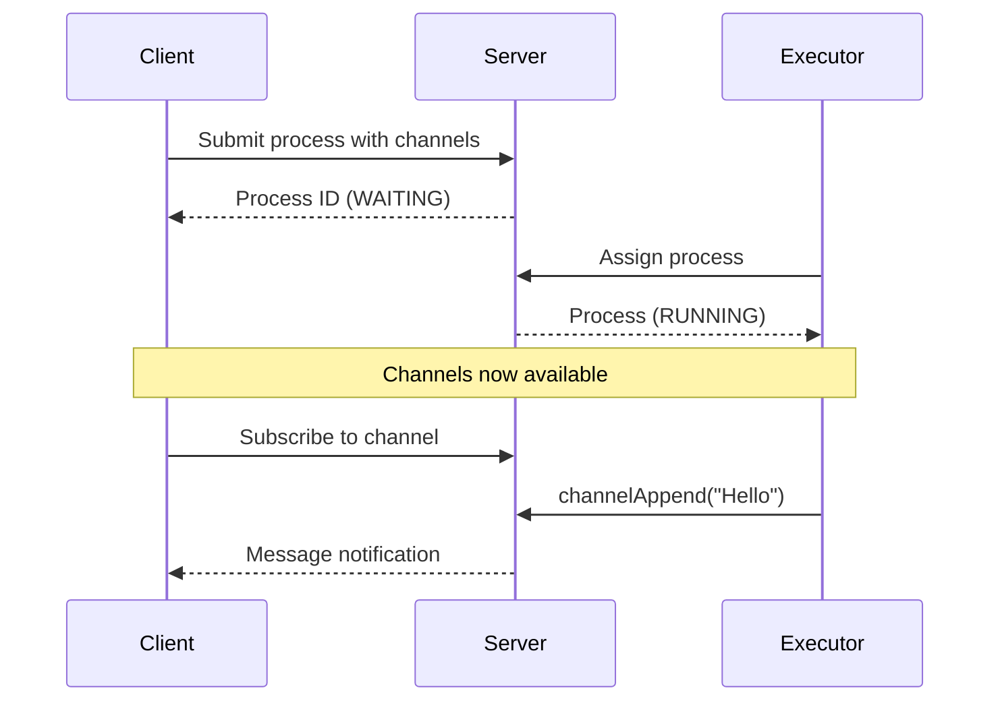

# Colonies TS Client Library

[](https://github.com/colonyos/colonies-ts/actions/workflows/node.yml)
[](https://codecov.io/gh/colonyos/colonies-ts)
[](https://www.npmjs.com/package/colonies-ts)
[](https://opensource.org/licenses/MIT)

TypeScript client library for ColonyOS.

## Architecture Overview



## Installation

```bash
npm install colonies-ts
```

## Quick Start

```typescript
import { ColoniesClient, Crypto } from 'colonies-ts';

// Create a client
const client = new ColoniesClient({
  host: 'localhost',
  port: 50080,
  tls: false,
});

// Set your private key
client.setPrivateKey('your-private-key-hex');

// Submit a function spec
const process = await client.submitFunctionSpec({
  funcname: 'my-function',
  conditions: {
    colonyname: 'my-colony',
    executortype: 'my-executor-type',
  },
  maxwaittime: 60,
  maxexectime: 60,
});

console.log('Process ID:', process.processid);
```

## Channels

Channels provide real-time bidirectional messaging between clients and executors.



See the [Channels Tutorial](tutorials/channels.md) for complete documentation on:
- Defining channels in a process
- Waiting for process assignment
- Sending and receiving messages
- WebSocket streaming
- Bidirectional communication patterns

## Crypto

The library includes a self-contained secp256k1 ECDSA implementation:

```typescript
import { Crypto } from 'colonies-ts';

const crypto = new Crypto();

// Generate a new private key
const privateKey = crypto.generatePrivateKey();

// Derive the public ID from a private key
const id = crypto.id(privateKey);

// Sign a message
const signature = crypto.sign('message', privateKey);
```

## Tutorials

- [Getting Started](tutorials/getting-started.md) - Introduction to ColonyOS and basic usage
- [Using Channels](tutorials/channels.md) - Real-time messaging between clients and executors
- [API Reference](tutorials/api-reference.md) - Complete API documentation

## Development

### Prerequisites

- Node.js >= 18
- npm

### Install dependencies

```bash
npm install
```

### Run tests

```bash
npm test                 # Unit tests
npm run test:integration # Integration tests (requires running server)
npm run test:all         # All tests
```

Integration tests require a running ColonyOS server:

```bash
cd /path/to/colonies
docker-compose up -d
```

### Build

```bash
npm run build
```

This generates ESM and CommonJS builds in the `dist/` directory.

## API Reference

### ColoniesClient

```typescript
new ColoniesClient({
  host: string,      // Server hostname
  port: number,      // Server port
  tls?: boolean,     // Enable TLS (default: false)
})
```

#### Methods

| Method | Description |
|--------|-------------|
| `setPrivateKey(key)` | Set the private key for signing requests |
| `getColonies()` | List all colonies |
| `getStatistics()` | Get server statistics |
| `getExecutors(colonyName)` | List executors in a colony |
| `submitFunctionSpec(spec)` | Submit a process |
| `assign(colonyName, timeout, prvKey)` | Assign a process to execute |
| `getProcess(processId)` | Get process details |
| `getProcesses(colonyName, count, state)` | List processes |
| `closeProcess(processId, output)` | Close a process successfully |
| `removeProcess(processId)` | Remove a process |
| `removeAllProcesses(colonyName, state)` | Remove all processes |
| `submitWorkflowSpec(spec)` | Submit a workflow |
| `getProcessGraph(graphId)` | Get workflow details |
| `getCrons(colonyName)` | List cron jobs |
| `addCron(cronSpec)` | Add a cron job |
| `getGenerators(colonyName)` | List generators |
| `addGenerator(generatorSpec)` | Add a generator |
| `channelAppend(processId, channelName, seq, inReplyTo, payload)` | Send message to channel |
| `channelRead(processId, channelName, afterSeq, limit)` | Read messages from channel |
| `subscribeChannelWS(...)` | Subscribe to channel via WebSocket |
| `subscribeProcessWS(...)` | Subscribe to process state changes |

### ProcessState

```typescript
enum ProcessState {
  WAITING = 0,
  RUNNING = 1,
  SUCCESS = 2,
  FAILED = 3,
}
```

## License

MIT
