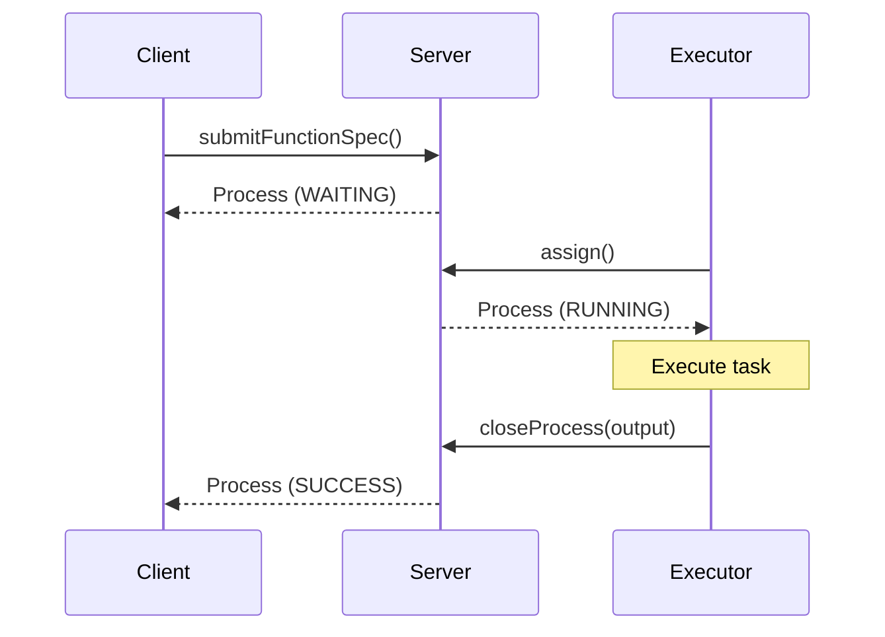
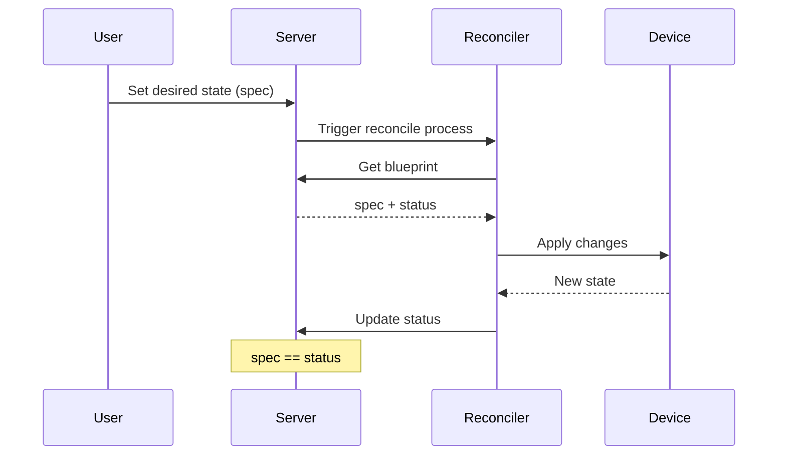
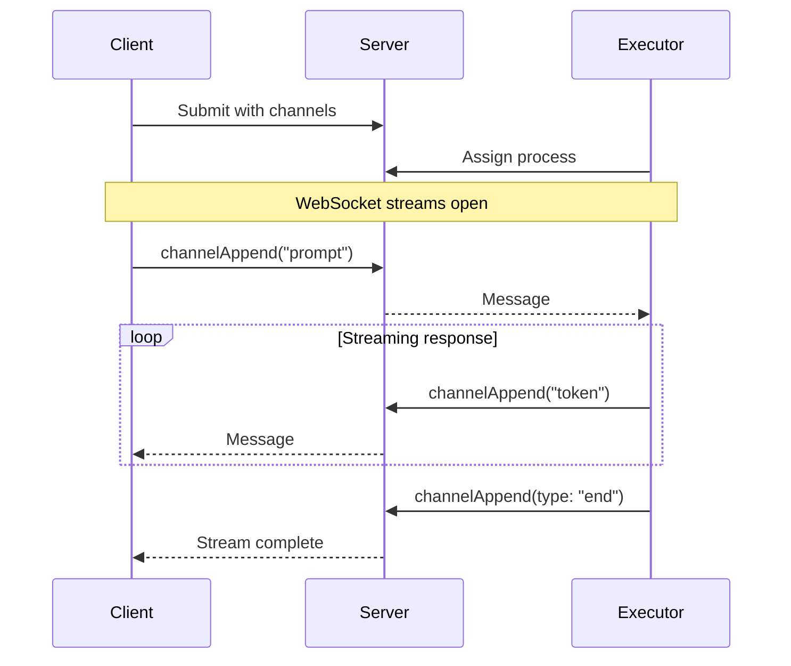

# Colonies TS Client Library

[](https://github.com/colonyos/colonies-ts/actions/workflows/node.yml)
[](https://codecov.io/gh/colonyos/colonies-ts)
[](https://www.npmjs.com/package/colonies-ts)
[](https://opensource.org/licenses/MIT)

TypeScript client library for ColonyOS - a distributed meta-orchestrator for compute continuums.

## Installation

```bash
npm install colonies-ts
```

## Three Execution Patterns

ColonyOS supports three patterns for distributed task execution:

### 1. Batch Processing

Traditional request-response pattern for discrete tasks. Submit a job, an executor picks it up, processes it, and returns the result.



```typescript
// Submit a batch job
const process = await client.submitFunctionSpec({
  funcname: 'process-image',
  kwargs: { imageUrl: 'https://example.com/image.jpg' },
  conditions: {
    colonyname: 'my-colony',
    executortype: 'image-processor',
  },
  maxexectime: 300,
});

// Wait for result
const result = await client.getProcess(process.processid);
console.log('Output:', result.output);
```

### 2. Blueprint Reconciliation

Declarative desired-state pattern for managing resources. Define the desired state in a blueprint, and a reconciler continuously ensures the actual state matches.



```typescript
// Create a blueprint with desired state
await client.addBlueprint({
  kind: 'HomeDevice',
  metadata: { name: 'living-room-light', colonyname: 'home' },
  handler: { executortype: 'home-reconciler' },
  spec: { power: true, brightness: 80 },  // Desired state
});

// Update desired state - reconciler will sync
const bp = await client.getBlueprint('home', 'living-room-light');
bp.spec.brightness = 50;
await client.updateBlueprint(bp);

// Or via CLI: colonies blueprint set --name living-room-light --key spec.brightness --value 50
```

### 3. Real-time Channels

Bidirectional streaming for interactive workloads like chat, live data, or long-running processes with progress updates.



```typescript
// Submit process with channel
const process = await client.submitFunctionSpec({
  funcname: 'chat',
  kwargs: { model: 'llama3' },
  conditions: { colonyname: 'ai', executortype: 'llm' },
  channels: ['chat'],
});

// Subscribe to streaming response
client.subscribeChannelWS(
  process.processid, 'chat', 0, 300,
  (entries) => {
    for (const entry of entries) {
      if (entry.type === 'end') return;
      process.stdout.write(entry.payload);
    }
  },
  console.error,
  () => {}
);

// Send message
await client.channelAppend(process.processid, 'chat', 1, 0, 'Hello!');
```

## Crypto

The library includes a self-contained secp256k1 ECDSA implementation:

```typescript
import { Crypto } from 'colonies-ts';

const crypto = new Crypto();

// Generate a new private key
const privateKey = crypto.generatePrivateKey();

// Derive the public ID from a private key
const id = crypto.id(privateKey);

// Sign a message
const signature = crypto.sign('message', privateKey);
```

## Documentation

- [Getting Started](docs/getting-started.md) - Introduction to ColonyOS and basic usage
- [Using Channels](docs/channels.md) - Real-time messaging between clients and executors
- [Building Reconcilers](docs/reconciler.md) - Blueprint and reconciler tutorial
- [API Reference](docs/api-reference.md) - Complete API documentation

## Development

### Prerequisites

- Node.js >= 18
- npm

### Install dependencies

```bash
npm install
```

### Run tests

```bash
npm test                 # Unit tests
npm run test:integration # Integration tests (requires running server)
npm run test:all         # All tests
```

Integration tests require a running ColonyOS server:

```bash
cd /path/to/colonies
docker-compose up -d
```

### Build

```bash
npm run build
```

This generates ESM and CommonJS builds in the `dist/` directory.

## API Reference

### ColoniesClient

```typescript
new ColoniesClient({
  host: string,      // Server hostname
  port: number,      // Server port
  tls?: boolean,     // Enable TLS (default: false)
})
```

#### Methods

| Method | Description |
|--------|-------------|
| `setPrivateKey(key)` | Set the private key for signing requests |
| `getColonies()` | List all colonies |
| `getStatistics()` | Get server statistics |
| `getExecutors(colonyName)` | List executors in a colony |
| `submitFunctionSpec(spec)` | Submit a process |
| `assign(colonyName, timeout, prvKey)` | Assign a process to execute |
| `getProcess(processId)` | Get process details |
| `getProcesses(colonyName, count, state)` | List processes |
| `closeProcess(processId, output)` | Close a process successfully |
| `removeProcess(processId)` | Remove a process |
| `removeAllProcesses(colonyName, state)` | Remove all processes |
| `submitWorkflowSpec(spec)` | Submit a workflow |
| `getProcessGraph(graphId)` | Get workflow details |
| `getCrons(colonyName)` | List cron jobs |
| `addCron(cronSpec)` | Add a cron job |
| `getGenerators(colonyName)` | List generators |
| `addGenerator(generatorSpec)` | Add a generator |
| `channelAppend(processId, channelName, seq, inReplyTo, payload)` | Send message to channel |
| `channelRead(processId, channelName, afterSeq, limit)` | Read messages from channel |
| `subscribeChannelWS(...)` | Subscribe to channel via WebSocket |
| `subscribeProcessWS(...)` | Subscribe to process state changes |
| `addBlueprintDefinition(definition)` | Add a blueprint definition |
| `getBlueprintDefinition(colonyName, name)` | Get a blueprint definition |
| `getBlueprintDefinitions(colonyName)` | List blueprint definitions |
| `removeBlueprintDefinition(colonyName, name)` | Remove a blueprint definition |
| `addBlueprint(blueprint)` | Add a blueprint |
| `getBlueprint(colonyName, name)` | Get a blueprint |
| `getBlueprints(colonyName, kind?, location?)` | List blueprints |
| `updateBlueprint(blueprint, forceGeneration?)` | Update a blueprint |
| `removeBlueprint(colonyName, name)` | Remove a blueprint |
| `updateBlueprintStatus(colonyName, name, status)` | Update blueprint status |
| `reconcileBlueprint(colonyName, name, force?)` | Trigger reconciliation |

### ProcessState

```typescript
enum ProcessState {
  WAITING = 0,
  RUNNING = 1,
  SUCCESS = 2,
  FAILED = 3,
}
```

## License

MIT
