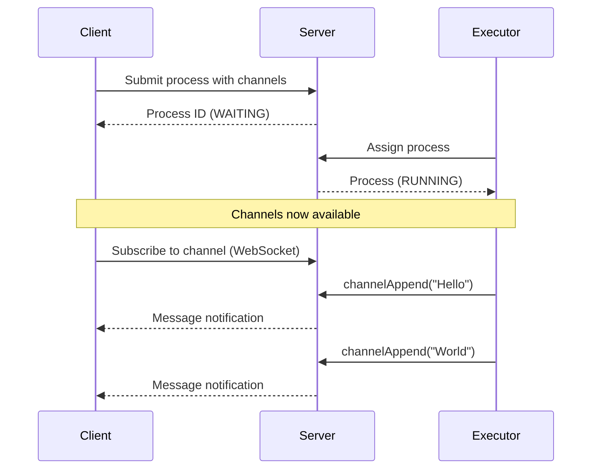
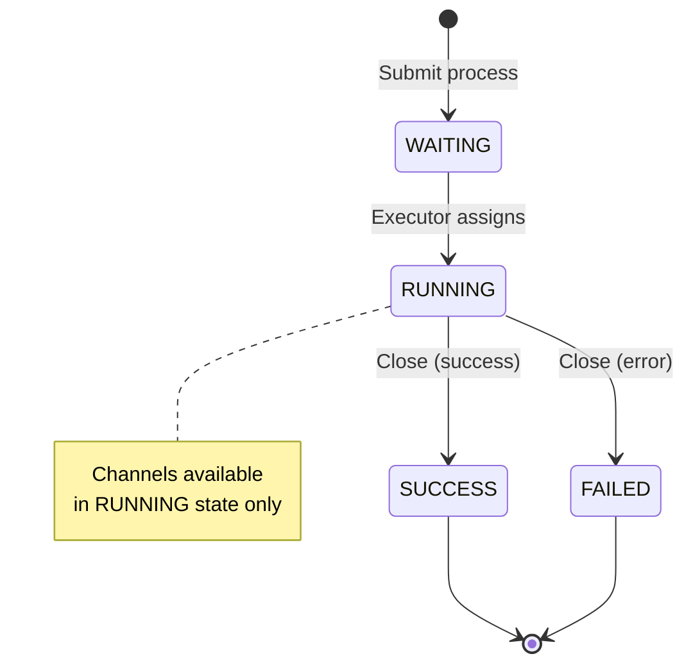
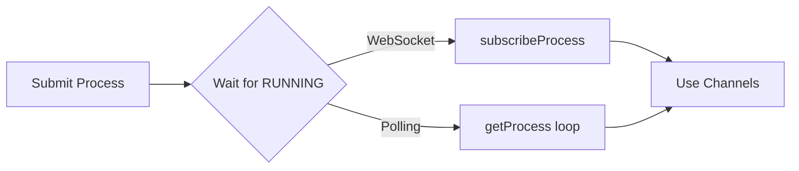
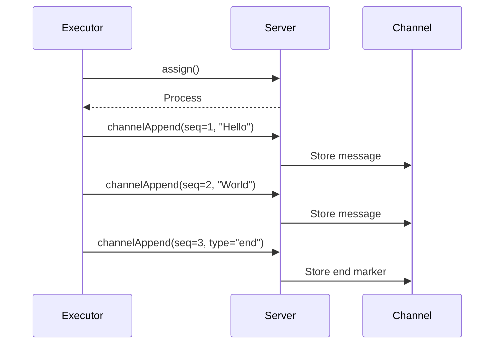
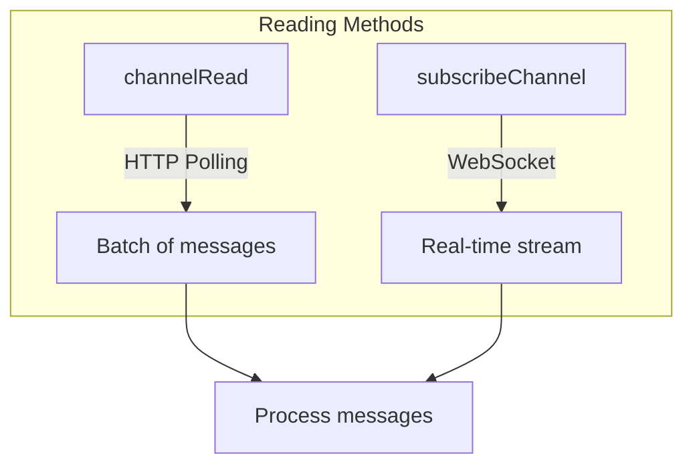
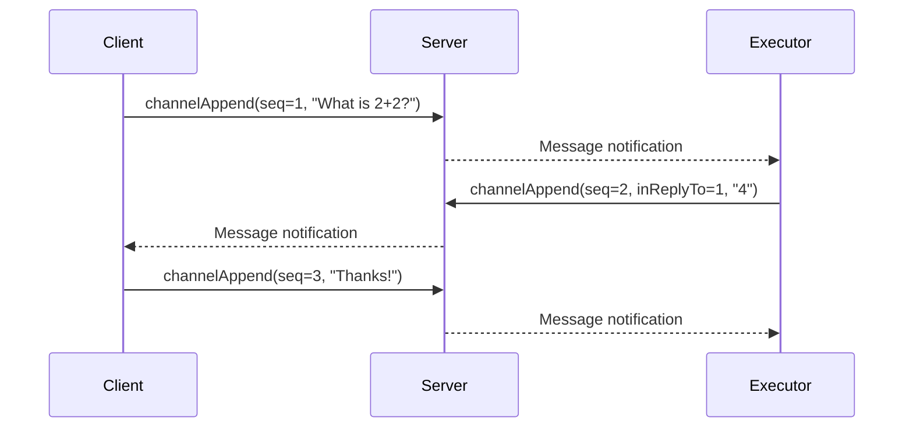

# Using Channels in ColonyOS

Channels provide real-time bidirectional messaging between clients and executors. This tutorial covers how to use channels for streaming data, implementing chat interfaces, and building interactive applications.

## Overview

Channels are named message queues attached to a process. They enable:
- Real-time streaming of data from executor to client
- Bidirectional communication between client and executor
- Message ordering with sequence numbers
- Request-response patterns with `inReplyTo` correlation

**Important**: Channels are only available after a process has been assigned to an executor (RUNNING state).



## Process Lifecycle and Channels



## Defining Channels

When submitting a process, declare the channels it will use:

```typescript
import { ColoniesClient } from 'colonies-ts';

const client = new ColoniesClient({
  host: 'localhost',
  port: 50080,
  tls: false,
});

client.setPrivateKey('your-executor-private-key');

const process = await client.submitFunctionSpec({
  funcname: 'my-function',
  conditions: {
    colonyname: 'my-colony',
    executortype: 'my-executor-type',
  },
  maxwaittime: 60,
  maxexectime: 300,
  channels: ['output', 'chat'],  // Define channels
});
```

## Waiting for Process Assignment

Before using channels, you must wait for the process to be assigned to an executor. There are two approaches:



### Option 1: WebSocket Subscription (Recommended)

Use `subscribeProcess` to receive a notification when the process enters RUNNING state:

```typescript
const processWs = client.subscribeProcess(
  'my-colony',
  process.processid,
  1,      // ProcessState.RUNNING
  300,    // timeout in seconds
  (runningProcess) => {
    console.log('Process is now running:', runningProcess.processid);
    processWs.close();

    // Now safe to use channels
    startUsingChannels(runningProcess.processid);
  },
  (error) => {
    console.error('Error waiting for process:', error);
  },
  () => {
    console.log('Process subscription closed');
  }
);
```

### Option 2: Polling

Poll the process status until it enters RUNNING state:

```typescript
async function waitForRunning(processId: string, timeoutMs: number): Promise<any> {
  const startTime = Date.now();

  while (Date.now() - startTime < timeoutMs) {
    const process = await client.getProcess(processId);
    if (process.state === 1) {  // RUNNING
      return process;
    }
    await new Promise(resolve => setTimeout(resolve, 500));
  }

  throw new Error('Timeout waiting for process to start');
}

const runningProcess = await waitForRunning(process.processid, 30000);
```

## Sending Messages (Executor Side)

As an executor, use `channelAppend` to send messages:



```typescript
// Assign the process first
const assigned = await client.assign('my-colony', 10, executorPrvKey);

// Send messages to the output channel
await client.channelAppend(
  assigned.processid,
  'output',           // channel name
  1,                  // sequence number (must be unique and increasing)
  0,                  // inReplyTo (0 = not a reply)
  'Hello from executor!'
);

// Send a reply to a specific message
await client.channelAppend(
  assigned.processid,
  'chat',
  2,                  // sequence
  1,                  // inReplyTo: replying to message with sequence 1
  'This is a reply to message 1'
);

// Send binary data
const binaryData = new Uint8Array([0x48, 0x65, 0x6c, 0x6c, 0x6f]);
await client.channelAppend(assigned.processid, 'output', 3, 0, binaryData);
```

## Reading Messages (Client Side)



### HTTP Polling

Use `channelRead` to fetch messages:

```typescript
// Read all messages from the beginning
const messages = await client.channelRead(
  processId,
  'output',           // channel name
  0,                  // afterSeq: read messages after this sequence (0 = from start)
  100                 // limit: max messages to return
);

for (const msg of messages) {
  console.log(`[${msg.sequence}] ${msg.payload}`);
}

// Read only new messages (after sequence 5)
const newMessages = await client.channelRead(processId, 'output', 5, 100);
```

### WebSocket Streaming (Recommended)

Use `subscribeChannel` for real-time streaming:

```typescript
const channelWs = client.subscribeChannel(
  processId,
  'output',           // channel name
  0,                  // afterSeq: start from beginning
  300,                // timeout in seconds
  (entries) => {
    // Called for each batch of new messages
    for (const entry of entries) {
      console.log(`[${entry.sequence}] ${entry.payload}`);

      // Check message type for stream control
      if (entry.type === 'end') {
        console.log('Stream ended');
        channelWs.close();
      } else if (entry.type === 'error') {
        console.error('Stream error:', entry.payload);
        channelWs.close();
      }
    }
  },
  (error) => {
    console.error('Channel error:', error);
  },
  () => {
    console.log('Channel subscription closed');
  }
);
```

## Bidirectional Communication

Channels support bidirectional messaging with request-response correlation:



## Complete Example: Streaming Chat

Here's a complete example implementing a chat interface:

```typescript
import { ColoniesClient, ProcessState } from 'colonies-ts';

async function runChatExample() {
  const client = new ColoniesClient({
    host: 'localhost',
    port: 50080,
    tls: false,
  });

  client.setPrivateKey('your-private-key');

  // 1. Submit a process with a chat channel
  const process = await client.submitFunctionSpec({
    funcname: 'chat-handler',
    conditions: {
      colonyname: 'my-colony',
      executortype: 'chat-executor',
    },
    maxwaittime: 60,
    maxexectime: 300,
    channels: ['chat'],
    kwargs: {
      prompt: 'Hello, how can I help you?'
    }
  });

  console.log('Submitted process:', process.processid);

  // 2. Wait for process to be assigned
  await new Promise<void>((resolve, reject) => {
    const ws = client.subscribeProcess(
      'my-colony',
      process.processid,
      ProcessState.RUNNING,
      60,
      (runningProcess) => {
        console.log('Process is running');
        ws.close();
        resolve();
      },
      reject,
      () => {}
    );
  });

  // 3. Subscribe to the chat channel for responses
  const responses: string[] = [];

  client.subscribeChannel(
    process.processid,
    'chat',
    0,
    300,
    (entries) => {
      for (const entry of entries) {
        if (entry.type === 'data' || !entry.type) {
          console.log('Assistant:', entry.payload);
          responses.push(entry.payload);
        } else if (entry.type === 'end') {
          console.log('Conversation ended');
        }
      }
    },
    (error) => console.error('Error:', error),
    () => console.log('Disconnected')
  );

  console.log('Chat session ready!');
}

runChatExample().catch(console.error);
```

## Message Entry Structure

Each message entry contains:

```typescript
interface MsgEntry {
  sequence: number;      // Unique sequence number
  inreplyto: number;     // Sequence of message this replies to (0 if not a reply)
  type?: string;         // Message type: 'data', 'end', 'error' (optional)
  payload: string;       // Message content (UTF-8 decoded)
}
```

## Best Practices

1. **Always wait for RUNNING state** before subscribing to channels
2. **Use WebSocket subscriptions** for real-time streaming instead of polling
3. **Handle the 'end' type** to know when the executor is done sending
4. **Use unique sequence numbers** - they must be increasing for each message
5. **Use inReplyTo** for request-response correlation in bidirectional communication
6. **Close WebSocket connections** when done to free server resources

## Process States

```typescript
enum ProcessState {
  WAITING = 0,   // Process submitted, waiting for executor
  RUNNING = 1,   // Assigned to executor, channels available
  SUCCESS = 2,   // Completed successfully
  FAILED = 3,    // Failed with error
}
```

## Error Handling

```typescript
try {
  const messages = await client.channelRead(processId, 'output', 0, 100);
} catch (error) {
  if (error.message.includes('channel not found')) {
    console.error('Channel does not exist or process not running');
  } else if (error.message.includes('process not found')) {
    console.error('Process does not exist');
  } else {
    console.error('Unexpected error:', error);
  }
}
```

## See Also

- [Getting Started](./getting-started.md) - Tutorial for beginners
- [Building Reconcilers](./reconciler.md) - Blueprint and reconciler tutorial
- [API Reference](./api-reference.md) - Full list of client methods
- [ColonyOS Documentation](https://colonyos.io) - Server-side implementation
