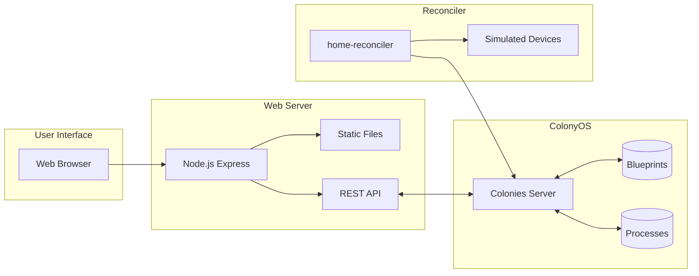
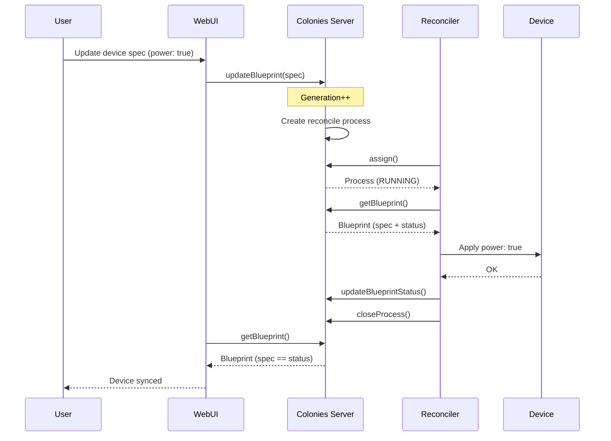

# Home Automation Example

A complete home automation web app using ColonyOS blueprints for managing smart devices.

## Architecture



## Reconciliation Flow



## Quick Start

### 1. Source environment

```bash
cd /path/to/colonies
source docker-compose.env
```

### 2. Install dependencies

```bash
cd examples/blueprint
npm install
```

### 3. Setup (create definition and sample devices)

```bash
npm run setup
```

### 4. Start the web server

```bash
npm start
```

### 5. Start the reconciler (in another terminal)

```bash
source /path/to/colonies/docker-compose.env
npm run reconciler
```

### 6. Open the web UI

Open http://localhost:3000 in your browser.

## Using the Colonies CLI

You can also manage devices using the colonies CLI:

### Add the blueprint definition

```bash
colonies blueprintdef add --spec home-device-def.json
```

### Add a device

```bash
colonies blueprint add --spec blueprints/living-room-light.json
```

### Set device state

```bash
# Turn on a light
colonies blueprint set --name living-room-light --key spec.power --value true

# Set brightness
colonies blueprint set --name living-room-light --key spec.brightness --value 80
```

### Trigger reconciliation

```bash
colonies blueprint reconcile --name living-room-light
```

### View device status

```bash
colonies blueprint get --name living-room-light
```

### List all devices

```bash
colonies blueprint ls
```

## File Structure

```
examples/blueprint/
  home-device-def.json     # Blueprint definition for HomeDevice kind
  blueprints/
    living-room-light.json  # Sample light device
    bedroom-light.json      # Sample light device
    living-room-thermostat.json  # Sample thermostat
  server.js                # Express web server
  reconciler.js            # Device reconciler
  setup.js                 # Setup script
  public/
    index.html             # Web UI
    app.js                 # Frontend JavaScript
    style.css              # Styles
```

## How It Works

### Blueprint Definition

The `home-device-def.json` defines the HomeDevice kind:

```json
{
  "kind": "HomeDevice",
  "metadata": {
    "name": "home-device-def",
    "colonyname": "dev"
  },
  "spec": {
    "names": {
      "kind": "HomeDevice"
    }
  }
}
```

### Device Blueprint

Each device is a blueprint with:
- **kind**: Must match a definition (HomeDevice)
- **spec**: Desired state (what you want)
- **status**: Current state (reported by reconciler)

Example light:
```json
{
  "kind": "HomeDevice",
  "metadata": { "name": "living-room-light", "colonyname": "dev" },
  "handler": { "executortype": "home-reconciler" },
  "spec": {
    "deviceType": "light",
    "room": "Living Room",
    "power": true,
    "brightness": 80
  }
}
```

### Reconciliation Flow

1. User updates device spec (desired state)
2. ColonyOS creates a reconcile process
3. Reconciler assigns the process
4. Reconciler reads the blueprint spec
5. Reconciler applies changes to the device
6. Reconciler updates the blueprint status
7. UI shows synced state

## Environment Variables

| Variable | Description | Default |
|----------|-------------|---------|
| `COLONIES_SERVER_HOST` | ColonyOS server hostname | localhost |
| `COLONIES_SERVER_PORT` | ColonyOS server port | 50080 |
| `COLONIES_SERVER_TLS` | Enable TLS | false |
| `COLONIES_COLONY_NAME` | Colony name | dev |
| `COLONIES_COLONY_PRVKEY` | Colony owner private key | (required) |
| `COLONIES_PRVKEY` | Executor private key | (required) |
| `WEB_PORT` | Web server port | 3000 |
