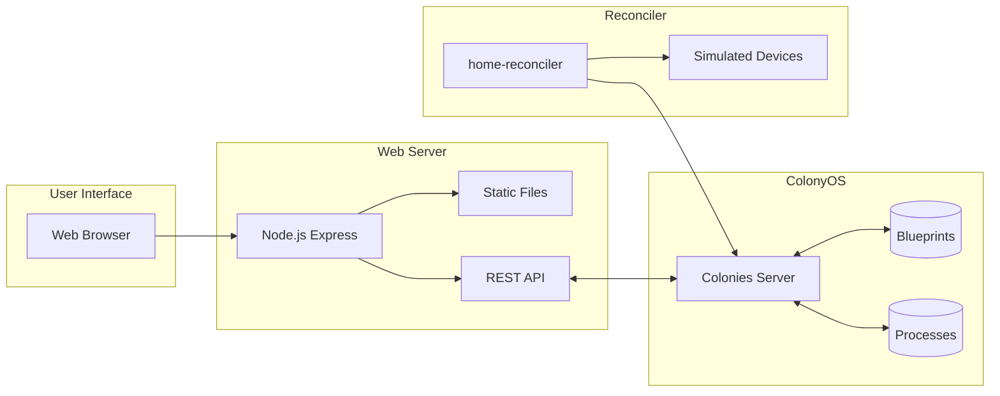
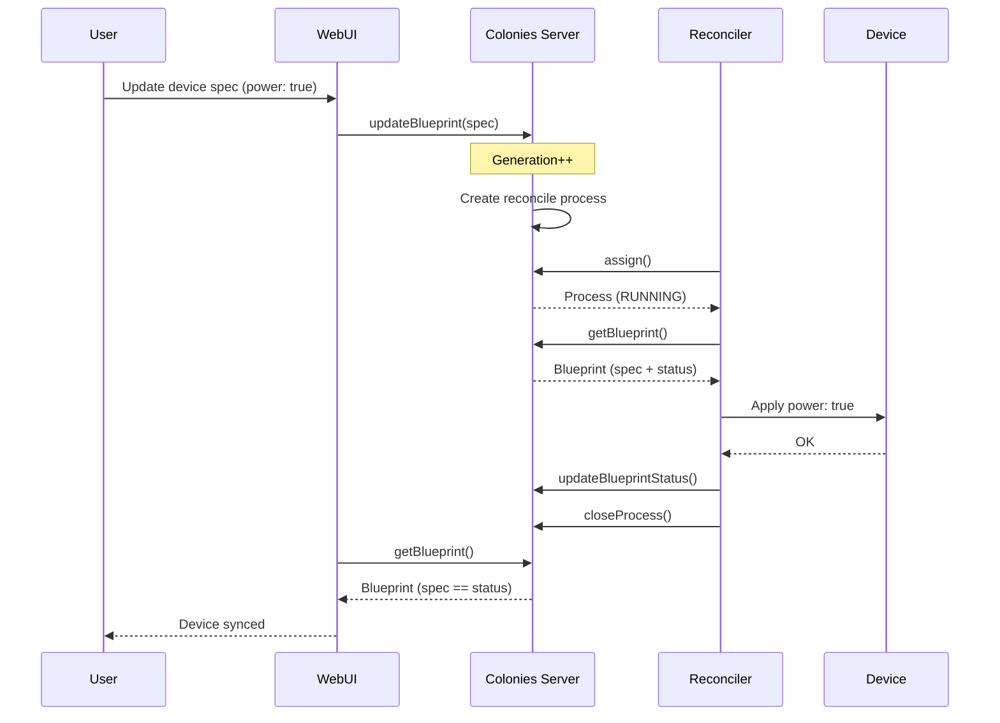

# Home Automation Example

A complete home automation web app using ColonyOS blueprints for managing smart devices.

## Architecture



## Reconciliation Flow



## Prerequisites

- Node.js >= 18
- Running ColonyOS server (via docker-compose)
- Colonies CLI installed (optional, for CLI commands)

## Quick Start

### 1. Start ColonyOS Server

If not already running, start the ColonyOS server:

```bash
cd /path/to/colonies
docker-compose up -d
```

Verify the server is running:

```bash
colonies server check
```

### 2. Source Environment Variables

The environment variables contain the server connection details and private keys:

```bash
cd /path/to/colonies
source docker-compose.env

# Verify environment is loaded
echo $COLONIES_COLONY_NAME
```

### 3. Install Dependencies

Navigate to the example directory and install Node.js dependencies:

```bash
cd /path/to/colonies-ts/examples/blueprint
npm install
```

### 4. Run Setup Script

The setup script creates the HomeDevice definition and sample devices:

```bash
npm run setup
```

Expected output:
```
==================================================
Home Automation Setup
==================================================
Colony: dev
Server: localhost:50080

--- Setting up Blueprint Definition ---

  Created: home-device-def (kind: HomeDevice)

--- Setting up Sample Devices ---

  Created: living-room-light (light)
  Created: bedroom-light (light)
  Created: living-room-thermostat (thermostat)

--- Current Devices ---

  living-room-light
    Type: light, Room: Living Room
    State: no status

==================================================
Setup complete!
==================================================
```

### 5. Start the Web Server

```bash
npm start
```

Expected output:
```
Home Automation Web UI running at http://localhost:3000
Connected to ColonyOS at localhost:50080
Colony: dev
```

### 6. Start the Reconciler

Open a new terminal, source the environment, and start the reconciler:

```bash
cd /path/to/colonies
source docker-compose.env

cd /path/to/colonies-ts/examples/blueprint
npm run reconciler
```

Expected output:
```
==================================================
Home Automation Reconciler
==================================================
Colony: dev
Server: localhost:50080
Registering reconciler executor...
Executor registered and approved

Waiting for reconcile processes...
```

### 7. Open the Web UI

Open http://localhost:3000 in your browser.

## Using the Web UI

### Viewing Devices

The main screen shows all configured devices as cards:
- **Green border**: Device is synced (spec == status)
- **Orange border**: Device is out of sync
- **No border**: No status reported yet

### Controlling a Device

1. Click on a device card to open the control panel
2. Use the toggles and sliders to set desired state
3. Changes are saved automatically to the blueprint spec
4. The reconciler will apply changes and update the status

### Adding a New Device

1. Click "+ Add Device"
2. Enter a unique device name (e.g., "kitchen-light")
3. Select the device type (HomeDevice)
4. Optionally enter a room name
5. Click "Add Device"

### Adding a Device Type

1. Click "+ Add Type"
2. Enter a definition name (e.g., "smart-switch-def")
3. Enter the kind (e.g., "SmartSwitch")
4. Click "Add Type"

### Triggering Reconciliation

1. Open a device control panel
2. Click "Reconcile" to manually trigger reconciliation
3. The reconciler will apply the current spec to the device

## Using the Colonies CLI

You can also manage devices using the colonies CLI:

### Add the blueprint definition

```bash
colonies blueprintdef add --spec home-device-def.json
```

### Add a device

```bash
colonies blueprint add --spec blueprints/living-room-light.json
```

### Set device state

```bash
# Turn on a light
colonies blueprint set --name living-room-light --key spec.power --value true

# Set brightness
colonies blueprint set --name living-room-light --key spec.brightness --value 80
```

### Trigger reconciliation

```bash
colonies blueprint reconcile --name living-room-light
```

### View device status

```bash
colonies blueprint get --name living-room-light
```

### List all devices

```bash
colonies blueprint ls
```

## File Structure

```
examples/blueprint/
  home-device-def.json     # Blueprint definition for HomeDevice kind
  blueprints/
    living-room-light.json  # Sample light device
    bedroom-light.json      # Sample light device
    living-room-thermostat.json  # Sample thermostat
  server.js                # Express web server
  reconciler.js            # Device reconciler
  setup.js                 # Setup script
  public/
    index.html             # Web UI
    app.js                 # Frontend JavaScript
    style.css              # Styles
```

## How It Works

### Blueprint Definition

The `home-device-def.json` defines the HomeDevice kind:

```json
{
  "kind": "HomeDevice",
  "metadata": {
    "name": "home-device-def",
    "colonyname": "dev"
  },
  "spec": {
    "names": {
      "kind": "HomeDevice"
    }
  }
}
```

### Device Blueprint

Each device is a blueprint with:
- **kind**: Must match a definition (HomeDevice)
- **spec**: Desired state (what you want)
- **status**: Current state (reported by reconciler)

Example light:
```json
{
  "kind": "HomeDevice",
  "metadata": { "name": "living-room-light", "colonyname": "dev" },
  "handler": { "executortype": "home-reconciler" },
  "spec": {
    "deviceType": "light",
    "room": "Living Room",
    "power": true,
    "brightness": 80
  }
}
```

### Reconciliation Flow

1. User updates device spec (desired state)
2. ColonyOS creates a reconcile process
3. Reconciler assigns the process
4. Reconciler reads the blueprint spec
5. Reconciler applies changes to the device
6. Reconciler updates the blueprint status
7. UI shows synced state

## Environment Variables

| Variable | Description | Default |
|----------|-------------|---------|
| `COLONIES_SERVER_HOST` | ColonyOS server hostname | localhost |
| `COLONIES_SERVER_PORT` | ColonyOS server port | 50080 |
| `COLONIES_SERVER_TLS` | Enable TLS | false |
| `COLONIES_COLONY_NAME` | Colony name | dev |
| `COLONIES_COLONY_PRVKEY` | Colony owner private key | (required) |
| `COLONIES_PRVKEY` | Executor private key | (required) |
| `WEB_PORT` | Web server port | 3000 |

## Troubleshooting

### "fetch failed" Error

This means the setup script cannot connect to the ColonyOS server.

**Check if the server is running:**
```bash
# Check if colonies container is running
docker ps | grep colonies

# Check server logs
docker logs colonies

# Test server connectivity
curl http://localhost:50080/api
```

**Start the server if not running:**
```bash
cd /path/to/colonies
docker-compose up -d
```

**Check environment variables:**
```bash
echo "Host: $COLONIES_SERVER_HOST"
echo "Port: $COLONIES_SERVER_PORT"
```

### "Access denied, not colony owner" Error

You're using the wrong private key. Blueprint definitions require the colony owner key.

**Verify you sourced the correct environment:**
```bash
source /path/to/colonies/docker-compose.env
echo $COLONIES_COLONY_PRVKEY
```

### "BlueprintDefinition for kind 'X' not found" Error

The blueprint definition doesn't exist or has the wrong structure.

**Create the definition first:**
```bash
npm run setup
# or
colonies blueprintdef add --spec home-device-def.json
```

**Verify definition exists:**
```bash
colonies blueprintdef ls
colonies blueprintdef get --name home-device-def
```

### Devices Not Syncing

If devices show "out of sync" but the reconciler is running:

1. Check the reconciler terminal for errors
2. Manually trigger reconciliation:
   ```bash
   colonies blueprint reconcile --name living-room-light
   ```
3. Verify the reconciler is registered:
   ```bash
   colonies executor ls
   ```

### Web UI Not Loading

1. Check if the server is running: `npm start`
2. Verify the port is correct (default: 3000)
3. Check for errors in the terminal
4. Try a different port: `WEB_PORT=3001 npm start`

### Connection Timeout

If using TLS or a remote server:

```bash
export COLONIES_SERVER_HOST=your-server.com
export COLONIES_SERVER_PORT=443
export COLONIES_SERVER_TLS=true
```
