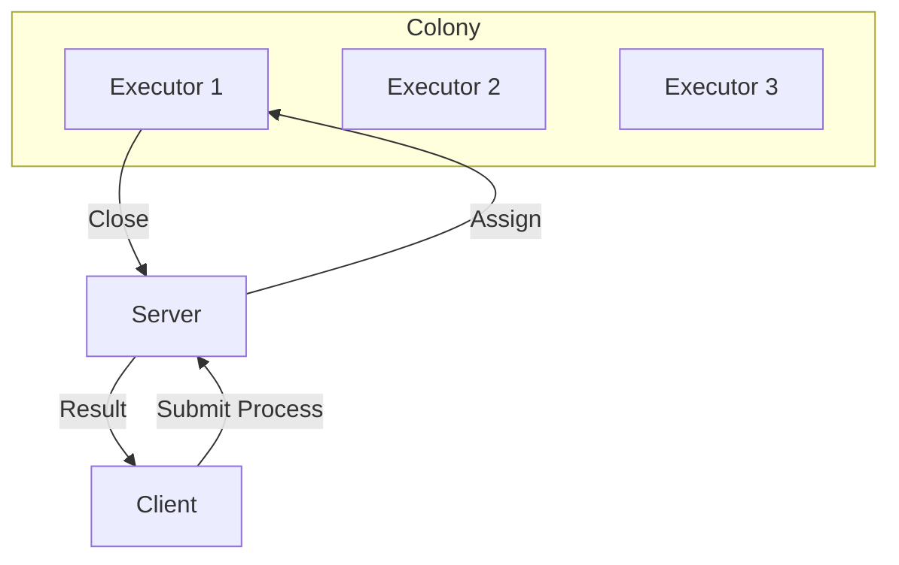
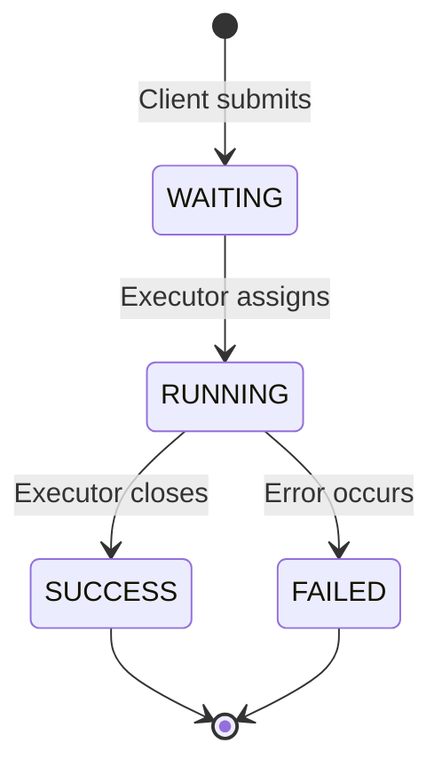
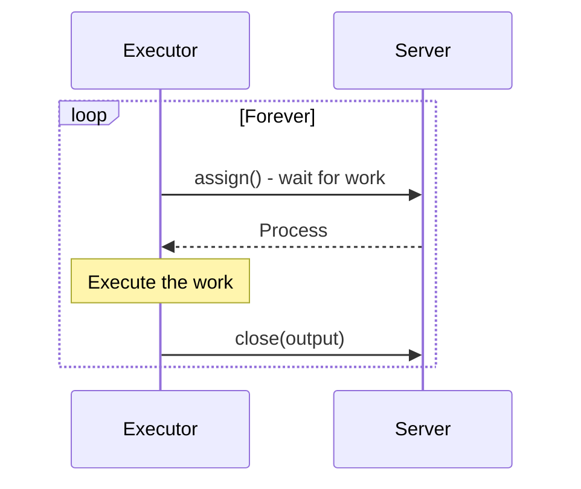
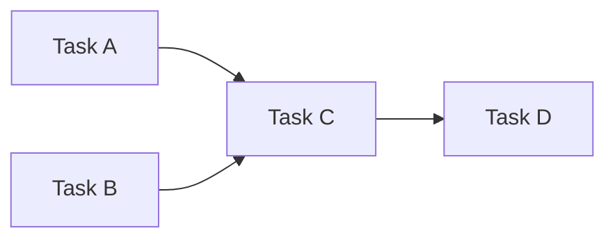

# Getting Started with colonies-ts

This tutorial covers the fundamentals of using the ColonyOS TypeScript client to submit processes, build executors, and interact with the ColonyOS distributed computing platform.

## What is ColonyOS?

ColonyOS is a distributed meta-orchestrator that coordinates workloads across different platforms. The key concepts are:



- **Colony**: A group of executors that can run processes
- **Executor**: A worker that pulls and executes processes
- **Process**: A unit of work defined by a FunctionSpec
- **FunctionSpec**: Specification describing what to run and execution conditions

## Installation

```bash
npm install colonies-ts
```

## Process Lifecycle

Every process goes through these states:



## Creating a Client

```typescript
import { ColoniesClient, Crypto } from 'colonies-ts';

const client = new ColoniesClient({
  host: 'localhost',
  port: 50080,
  tls: false,
});

// Set your private key for authentication
client.setPrivateKey('your-private-key-hex');
```

## Submitting a Process

A client submits a process by providing a FunctionSpec:

```typescript
const process = await client.submitFunctionSpec({
  funcname: 'compute-task',
  conditions: {
    colonyname: 'my-colony',
    executortype: 'worker',
  },
  maxwaittime: 60,   // Max seconds to wait for assignment
  maxexectime: 300,  // Max seconds for execution
  kwargs: {
    input: 'Hello, World!',
    iterations: 100,
  },
});

console.log('Submitted process:', process.processid);
console.log('State:', process.state);  // 0 = WAITING
```

## Building an Executor

An executor is a worker that:
1. Registers with the colony
2. Assigns (pulls) processes
3. Executes the work
4. Closes the process with results



### Simple Executor Example

```typescript
import { ColoniesClient } from 'colonies-ts';

const client = new ColoniesClient({
  host: 'localhost',
  port: 50080,
  tls: false,
});

const EXECUTOR_PRV_KEY = 'your-executor-private-key';
const COLONY_NAME = 'my-colony';

async function runExecutor() {
  client.setPrivateKey(EXECUTOR_PRV_KEY);

  console.log('Executor started, waiting for work...');

  while (true) {
    try {
      // Wait for a process (blocks until one is available or timeout)
      const process = await client.assign(COLONY_NAME, 60, EXECUTOR_PRV_KEY);

      console.log('Assigned process:', process.processid);
      console.log('Function:', process.functionspec.funcname);
      console.log('Args:', process.functionspec.kwargs);

      // Execute the work based on the function name
      let result: string[];

      switch (process.functionspec.funcname) {
        case 'compute-task':
          result = await handleComputeTask(process);
          break;
        case 'echo':
          result = [process.functionspec.kwargs?.message || 'No message'];
          break;
        default:
          result = ['Unknown function'];
      }

      // Close the process with the result
      await client.closeProcess(process.processid, result);
      console.log('Process completed:', process.processid);

    } catch (error: any) {
      if (error.message?.includes('timeout')) {
        // No work available, loop and try again
        continue;
      }
      console.error('Error:', error.message);
    }
  }
}

async function handleComputeTask(process: any): Promise<string[]> {
  const input = process.functionspec.kwargs?.input || '';
  const iterations = process.functionspec.kwargs?.iterations || 1;

  // Simulate work
  let result = input;
  for (let i = 0; i < iterations; i++) {
    result = result.toUpperCase();
  }

  return [result];
}

runExecutor();
```

## Getting Process Results

After an executor closes a process, retrieve the results:

```typescript
// Submit a process
const submitted = await client.submitFunctionSpec({
  funcname: 'echo',
  conditions: {
    colonyname: 'my-colony',
    executortype: 'worker',
  },
  maxwaittime: 60,
  maxexectime: 60,
  kwargs: { message: 'Hello!' },
});

// Poll for completion
async function waitForCompletion(processId: string): Promise<any> {
  while (true) {
    const process = await client.getProcess(processId);

    if (process.state === 2) {  // SUCCESS
      return process;
    } else if (process.state === 3) {  // FAILED
      throw new Error('Process failed: ' + process.errors?.join(', '));
    }

    await new Promise(r => setTimeout(r, 1000));
  }
}

const completed = await waitForCompletion(submitted.processid);
console.log('Result:', completed.output);
```

## Using WebSocket for Process State

Instead of polling, use WebSocket to get notified when a process completes:

```typescript
const process = await client.submitFunctionSpec({
  funcname: 'compute-task',
  conditions: {
    colonyname: 'my-colony',
    executortype: 'worker',
  },
  maxwaittime: 60,
  maxexectime: 60,
});

// Subscribe to SUCCESS state
client.subscribeProcessWS(
  'my-colony',
  process.processid,
  2,  // ProcessState.SUCCESS
  300,
  (completedProcess) => {
    console.log('Process completed!');
    console.log('Output:', completedProcess.output);
  },
  (error) => {
    console.error('Error:', error);
  },
  () => {
    console.log('Subscription closed');
  }
);
```

## Working with Multiple Processes

### List Processes by State

```typescript
// Get all waiting processes
const waiting = await client.getProcesses('my-colony', 100, 0);
console.log('Waiting processes:', waiting.length);

// Get all running processes
const running = await client.getProcesses('my-colony', 100, 1);
console.log('Running processes:', running.length);

// Get all completed processes
const completed = await client.getProcesses('my-colony', 100, 2);
console.log('Completed processes:', completed.length);
```

### Clean Up Processes

```typescript
// Remove a specific process
await client.removeProcess(processId);

// Remove all processes in a state (-1 = all states)
await client.removeAllProcesses('my-colony', -1);
```

## Workflows

Submit multiple processes as a workflow (DAG):



```typescript
const workflow = await client.submitWorkflowSpec({
  colonyname: 'my-colony',
  functionspecs: [
    {
      nodename: 'task-a',
      funcname: 'process-data',
      conditions: { colonyname: 'my-colony', executortype: 'worker' },
      maxwaittime: 60,
      maxexectime: 60,
    },
    {
      nodename: 'task-b',
      funcname: 'process-data',
      conditions: { colonyname: 'my-colony', executortype: 'worker' },
      maxwaittime: 60,
      maxexectime: 60,
    },
    {
      nodename: 'task-c',
      funcname: 'merge-results',
      conditions: { colonyname: 'my-colony', executortype: 'worker' },
      maxwaittime: 60,
      maxexectime: 60,
      dependencies: ['task-a', 'task-b'],  // Wait for A and B
    },
    {
      nodename: 'task-d',
      funcname: 'finalize',
      conditions: { colonyname: 'my-colony', executortype: 'worker' },
      maxwaittime: 60,
      maxexectime: 60,
      dependencies: ['task-c'],
    },
  ],
});

console.log('Workflow ID:', workflow.processgraphid);
```

## Executor Registration

For production use, executors should register with the colony:

```typescript
import { Crypto } from 'colonies-ts';

const crypto = new Crypto();

// Generate a new executor identity
const executorPrvKey = crypto.generatePrivateKey();
const executorId = crypto.id(executorPrvKey);

// Register the executor (requires colony owner key)
client.setPrivateKey(colonyOwnerPrvKey);

await client.addExecutor({
  executorid: executorId,
  executortype: 'my-executor-type',
  executorname: 'my-executor-1',
  colonyname: 'my-colony',
});

// Approve the executor
await client.approveExecutor('my-colony', 'my-executor-1');

// Now the executor can assign processes
client.setPrivateKey(executorPrvKey);
const process = await client.assign('my-colony', 60, executorPrvKey);
```

## Cryptography

All communication is signed with secp256k1 ECDSA:

```typescript
import { Crypto } from 'colonies-ts';

const crypto = new Crypto();

// Generate a new key pair
const privateKey = crypto.generatePrivateKey();
console.log('Private key:', privateKey);

// Derive the public ID (used as executor/colony ID)
const id = crypto.id(privateKey);
console.log('ID:', id);

// Sign a message
const signature = crypto.sign('Hello, World!', privateKey);
console.log('Signature:', signature);
```

## Error Handling

```typescript
try {
  const process = await client.submitFunctionSpec({
    funcname: 'my-task',
    conditions: {
      colonyname: 'my-colony',
      executortype: 'worker',
    },
    maxwaittime: 60,
    maxexectime: 60,
  });
} catch (error: any) {
  if (error.message.includes('colony not found')) {
    console.error('Colony does not exist');
  } else if (error.message.includes('not authorized')) {
    console.error('Invalid or unauthorized private key');
  } else {
    console.error('Unexpected error:', error.message);
  }
}
```

## Complete Example: Client and Executor

### client.ts

```typescript
import { ColoniesClient } from 'colonies-ts';

const client = new ColoniesClient({
  host: 'localhost',
  port: 50080,
  tls: false,
});

client.setPrivateKey('executor-private-key');

async function main() {
  // Submit a task
  const process = await client.submitFunctionSpec({
    funcname: 'fibonacci',
    conditions: {
      colonyname: 'dev',
      executortype: 'math-worker',
    },
    maxwaittime: 60,
    maxexectime: 60,
    kwargs: { n: 10 },
  });

  console.log('Submitted:', process.processid);

  // Wait for result
  const ws = client.subscribeProcessWS(
    'dev',
    process.processid,
    2,  // SUCCESS
    60,
    (result) => {
      console.log('Fibonacci(10) =', result.output[0]);
      ws.close();
    },
    (error) => console.error(error),
    () => {}
  );
}

main();
```

### executor.ts

```typescript
import { ColoniesClient } from 'colonies-ts';

const client = new ColoniesClient({
  host: 'localhost',
  port: 50080,
  tls: false,
});

const EXECUTOR_KEY = 'executor-private-key';

function fibonacci(n: number): number {
  if (n <= 1) return n;
  return fibonacci(n - 1) + fibonacci(n - 2);
}

async function main() {
  client.setPrivateKey(EXECUTOR_KEY);

  while (true) {
    try {
      const process = await client.assign('dev', 60, EXECUTOR_KEY);

      if (process.functionspec.funcname === 'fibonacci') {
        const n = process.functionspec.kwargs?.n || 0;
        const result = fibonacci(n);
        await client.closeProcess(process.processid, [String(result)]);
      }
    } catch (e: any) {
      if (!e.message?.includes('timeout')) {
        console.error(e);
      }
    }
  }
}

main();
```

## Next Steps

- [Using Channels](./channels.md) - Real-time messaging between clients and executors
- [ColonyOS Documentation](https://colonyos.io) - Server setup and administration
